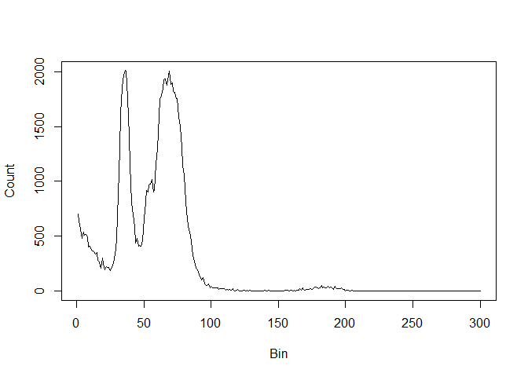
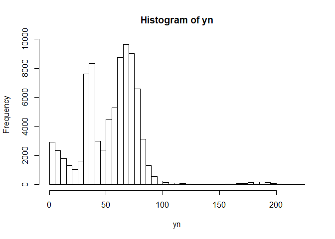
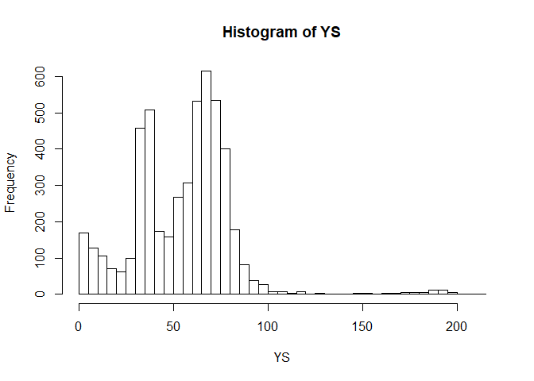
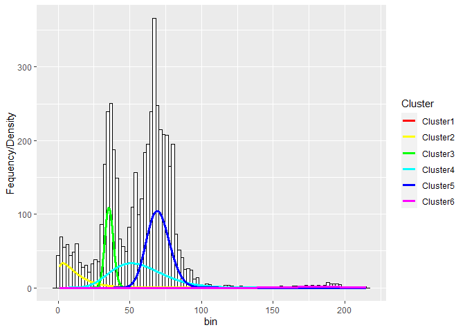

Load a data file and have a looksie.

```r
setwd("C:/Users/Jacob Strock/Documents/Menden-Deuer Lab/Misc/")
df=read.csv('gyro_2_test2_rep4.csv')
plot(df$Bin,df$Count,type='l',ylab="Count", xlab="Bin")
```

<!-- -->

The data file is frequency data. Let's convert the frequency data into raw observations

```r
library(vcdExtra)
```

```
## Warning: package 'vcdExtra' was built under R version 3.6.3
```

```
## Warning: package 'vcd' was built under R version 3.6.3
```

```
## Warning: package 'gnm' was built under R version 3.6.3
```

```r
y = expand.dft(df,freq = "Count")
yn= na.omit(as.vector(as.numeric(as.character(y[,1]))))
hist(yn, breaks = 50)
```

<!-- -->

Subsample the data for speed, but replot the histogram to make sure this sample size will adequately describe the data.

```r
RS=sample(1:length(yn),5000)
YS=yn[RS]
hist(YS, breaks=50)
```

<!-- -->

Specify the number of expected groups in the data (excluding the exponential cline of detrital material).

```r
g=5
```

EM algorithm: Iteratively finding the expected cluster ID for each particle, then find the maximum likelihood estimates of the parameter values for each of the clusters. Store all of this. For this data we are using a mixture of an exponential distribution for the detrital material, and gamma distributions for the populations of interest in the data. We will manually specify the number of populations because in this lab data, we know how many should be there. Of course you can add more if you see interesting features in the data you want to isolate.

Mathematical details of the two cluster case can be found in  Erişoğlu et al. 2011. Here, I have added the flexibility of more clusters.

Erişoğlu, Ü., Erişoğlu, M., & Erol, H. (2011). A mixture model of two different distributions approach to the analysis of heterogeneous survival data. International Journal of Computational and Mathematical Sciences, 5(2), 75-79.


If you are adding or removing clusters, you will need to add or remove new shape, and scale parameters for the gamma distributions. A quick initialization that works well here is to provide an $\alpha$ value at the mean of the peaks. A $\beta of 1 will work fine. Note, the mean of a gamma distribution is $\alpha\beta$ and the variance is $\alpha\beta^2$. If you are having trouble with fits, try adjusting these starting parameters closer to the expected moments, and or give a greater number of EM iterations to reach convergence.

```r
y=YS
#number of EM iterations
r = 500

#distribution weights
pi.out     = matrix(0, nrow = r+1, ncol = (g+1))
lambda.out = rep(0,r+1)
alpha.out  = matrix(0, nrow = r+1, ncol = g)
beta.out   = matrix(0, nrow = r+1, ncol = g)
p.group    = matrix(0, nrow = length(y), ncol = (g+1))
w.group    = matrix(0, nrow = length(y), ncol = (g+1))

#initialize
pi.out[1,]    = 1/(g+1)    #equal weights per cluster
lambda.out[1] = 1          #mean for exponential (keep it small)
alpha.out[1,] = c(20, 30, 40, 60, 100)#starting alpha for each group can change, not super important because will converge
beta.out[1,]  = c(1, 1, 1, 1, 1)#starting alpha for each group can change, not super important because will converge

#Run EM
for(i in 1:(r)){
  #Expectation step (expected group ID)
  p.group[,1] = pi.out[i,1]*dexp(y, rate = lambda.out[i])
  for(gg in 1:g){
    p.group[,1+gg]=pi.out[i,1+gg]*dgamma(y, shape = alpha.out[i,gg], scale = beta.out[i,gg])
  }
  for(gg in 1:(gg+1)){
    w.group[,gg] = p.group[,gg]/apply(p.group,1,sum) #expected group assignment for each observation
  }
  
  #Maximization step
  pi.out[i+1,]    = apply(w.group,2,sum)/length(y) #updated weights
  
  lambda.out[i+1] = sum(w.group[,1]*y )/ (pi.out[i+1,1]*length(y))
  
  for(gg in 1:g){
    
    #Newton Raphson for alpha
    alpha.r = alpha.out[i,gg]
    Dalpha.relative = 1
    while(Dalpha.relative>0.01){
      a.n =  log(alpha.r)-
      digamma(alpha.r)-
      log(sum(w.group[,1+gg]*y)/(pi.out[i+1,1+gg]*length(y)))+
      sum(w.group[,1+gg]*log(y))/(pi.out[i+1,1+gg]*length(y))
      
      a.d =  1/alpha.r-trigamma(alpha.r)
      alpha.r2 = alpha.r-a.n/a.d
      alpha.r2 = ifelse(alpha.r2<0,0.01,alpha.r2)
      Dalpha.relative = abs((alpha.r-alpha.r2)/alpha.r)
      alpha.r  = alpha.r2
    }
    
    alpha.out[i+1,gg] = alpha.r
    
    #Beta
    beta.out[i+1,gg]  = sum(w.group[,1+gg]*y) / (alpha.out[i+1,gg]*pi.out[i+1,1+gg]*length(y))
  }
}
```

Make a grid of points to check the density.

```r
x.grid = seq(1,max(y), by=0.1)
x      = rep(x.grid, g+1)
y.pred = 0
ID     = 0
N      = length(y)
Pi     = pi.out[r,]
for(gg in 1:(g+1)){
  if(gg==1){
    y.pred=c(y.pred,dexp(x.grid,rate=lambda.out[r]))*N*Pi[gg]
  }else{
    y.pred=c(y.pred,dgamma(x.grid,shape=alpha.out[r,gg-1],scale = beta.out[r,gg-1])*N*Pi[gg])
  }
  ID = c(ID,rep(paste0("Cluster",gg),length(x.grid)))
}
pp = as.data.frame(do.call(cbind, list(ID[-1],y.pred[-1],x)))
```

Lets plot those densities with the data and see if it makes sense. Add/remove clusters as needed.

```r
library(ggplot2)
```

```
## Warning: package 'ggplot2' was built under R version 3.6.3
```

```r
YS=as.data.frame(y)
colnames(YS)='Raw'
pp$V2=as.numeric(as.character(pp$V2))
pp$V3=as.numeric(as.character(pp$V3))

ggplot(YS,aes(x=Raw))+
  geom_histogram(aes(y=..density..),fill='white',color='black')+
  stat_bin(bins=100,fill='white',color='black')+
  geom_line(data = pp, aes(x=V3, y=V2, col=V1),lwd=1.1)+
  scale_color_manual(values=rainbow(g+1),name='Cluster')
```

<!-- -->

If we want to know how many particles belong to each of these distributions, it is just the converged value of the weight for that distribution multiplied by the total particle count.

```r
library(formattable)
```

```
## Warning: package 'formattable' was built under R version 3.6.3
```

```r
y = expand.dft(df,freq = "Count")
yn= na.omit(as.vector(as.numeric(as.character(y[,1]))))
ID=unique(ID)[-1]
Count=round(Pi*length(yn),digits = 0)
Out.table=as.data.frame(cbind(ID,Count))
formattable(Out.table)
```


<table class="table table-condensed">
 <thead>
  <tr>
   <th style="text-align:right;"> ID </th>
   <th style="text-align:right;"> Count </th>
  </tr>
 </thead>
<tbody>
  <tr>
   <td style="text-align:right;"> Cluster1 </td>
   <td style="text-align:right;"> 0 </td>
  </tr>
  <tr>
   <td style="text-align:right;"> Cluster2 </td>
   <td style="text-align:right;"> 16763 </td>
  </tr>
  <tr>
   <td style="text-align:right;"> Cluster3 </td>
   <td style="text-align:right;"> 16700 </td>
  </tr>
  <tr>
   <td style="text-align:right;"> Cluster4 </td>
   <td style="text-align:right;"> 6746 </td>
  </tr>
  <tr>
   <td style="text-align:right;"> Cluster5 </td>
   <td style="text-align:right;"> 41593 </td>
  </tr>
  <tr>
   <td style="text-align:right;"> Cluster6 </td>
   <td style="text-align:right;"> 1263 </td>
  </tr>
</tbody>
</table>

