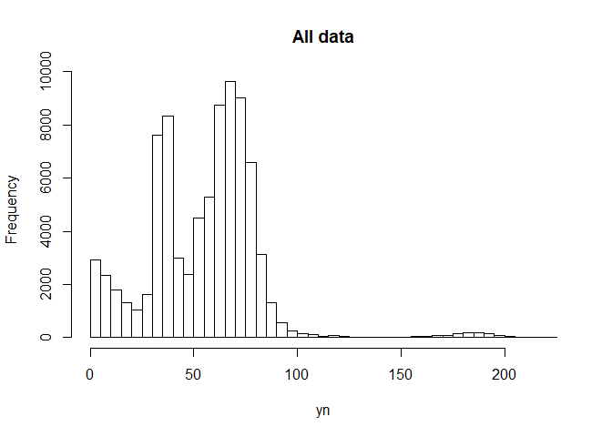
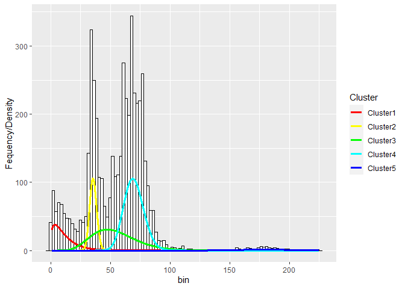

In this vignette I will show you how to process coulter counter data with a mixture model. 

**What is a mixture model?**

Well, intuitively it is exactly what we expect the data to be, a mixture of distributions. In terms of our coulter counter, we know different species and particle types will appear in the size frequency distribution of the data. By using a mixture model we will characterize the distribution of each of these particle types, as well as learn the weights of each distribution. If you multiply these weights by the total counts of particles, voila, we have the count of particles belonging to each of these distribution. In words, this is what we get applying mixture models to these data. A mixture model will have the following general form, where $\pi_k$ is the weight on cluster $k$ and $\theta_k$ the parameters for the distribution $f$ of cluster $k$:

$P(x)=\Sigma_{i=1}^{k}\pi_k f(x|\theta_k)$

The mixture model becomes especially important when the distributions may not be easily separable. Manual gating and discrete separations such as by k-means are going to be unrealistic here. Plainly this is because the distributions are substantially overlapping. We want a model that incorporates the fact that these particles distributions are mixed together. 

There are several important features we are going to have to account for in the coulter counter data. First we are dealing with particle size. This means that all our data must be positive. Second, we know that the distributions in the data can take very different shapes: some highly skewed, some symmetric, different locations, different scales. It is also commonly noted that detrital material often has an exponential signal in the size frequency data: that is there are many many small particles and this signal exponentially decays. How can we accommodate this? A mixture of gammas. 

Let's speak now with a little more math. The gamma distribution with shape ($\alpha$) and scale ($\beta$) parameterization has a probability density function defined as follows:

$f(x)=\frac{x^{\alpha-1}e^{-x/\beta}}{\Gamma(\alpha)\beta^\alpha}$

This distribution is always positive. Skewness of the gamma is equal to $2/\sqrt{\alpha}$ so can be controlled by $\alpha$. When $\alpha=1$, we have a special case of the gamma distribution, which is the exponential distribution. Recall this is practically important because we believe that the distribution of detrital material has an exponential shape, so we have the capacity to capture this. This last fact can be seen below, where using the common specification of the exponential distribution, $\lambda=1/\beta$:

$f(x)=\lambda e^{-\lambda x}$

So, if we use a mixture of gammas we can incorporate those important features like the exponential decay of detrital material, as well as all the actual populations of plankton in the data. 

**General Solution**

We will solve for our unknown parameters $\pi_{{1:k}}, \alpha_{{1:k}}, \beta_{{1:k}}$, via what is called the EM algorithm, that is Expectation, Maximization. It is two step: 

1.) We find the **e**xpected likelihood of our parameters over some latent parameters $z$, where $z$ will represent the membership of a particle to one of the $k$ distributions. This allows us to find the proceeding maximization step more easily.

2.) We find the **m**aximum likelihood estimates of our other unknown parameters $\pi_{{1:k}}, \alpha_{{1:k}}, \beta_{{1:k}}$ from the expected likelihood.

Repeat until convergence. 

**For the Gamma Mixtures Model**

For the gamma mixture model, in the E step to begin we find $E[z_{ki}|x_i]$ as:

$E[z_{ki}|x_i]=\frac {\pi_k f(x_i|\alpha_k,\beta_k)} {\Sigma_{j=1}^{K}\pi_j f(x_i|\alpha_j,\beta_j)}$

and now the expected likelihood $Q(\theta)$ of our other parameters with respect to $z$ given $x$ and the current estimates of $\theta_s$. Recall  $\theta=(\pi_{{1:k}}, \alpha_{{1:k}}, \beta_{{1:k}})$:

$Q(\theta)=E_{Z|X,\Theta^{(t)}}[logL(\theta|X,Z)]$

$=E_{Z|X,\Theta^{(t)}}[\Sigma_{i=1}^{n} logL(\theta|x_i,z_i)]$

$=\Sigma_{i=1}^{n} E_{Z_i|X,\Theta^{(t)}}[logL(\theta|x_i,z_i)]$

$=\Sigma_{i=1}^{n} \Sigma_{j=1}^{K}P(Z_i=j|X_i=x_i,\theta^{t})logL(\theta_j|x_i,z_i)$

Note that $\{\pi_{{1:k}}, \alpha_{{1:k}}, \beta_{{1:k}}\}$ for j=1...k are all linearly separable so may be maximized independently in the next step.

The weights $\pi_{1:K}$ are found as:

$\pi_j=\Sigma_{i=1}^{n}\hat{z}_{i}/n$

In the maximization step for $\alpha$ and 
$\beta$, because we cannot find the maxima directly as we can't solve for the roots analytically, we will use the Newton Raphson algorithm to solve for the roots of alpha. In Newton Raphson, we iteratively find the following until convergence:

$x_1=x_0-\frac{f(x_0)}{f'(x_0)}$

For our $\alpha$ parameter, this is translates to:

$\hat{\alpha_{r+1}}=\frac{\hat{\alpha_r}-ln(\hat{\alpha_{r}})-\Psi(\hat{\alpha_{r}})-ln(G)+ln(H)}{1/\hat{\alpha_{r}}-\Psi'(\hat{\alpha_{r+}})}$

$where, G=\frac{\Sigma_{i=1}^n \hat{z_j}x_j}{\Sigma_{i=1}^n \hat{z_j}}$

$G=\frac{\Sigma_{i=1}^n \hat{z_j}log(x_j)}{\Sigma_{i=1}^n \hat{z_j}}$

repeat until convergence

Given alpha, we can find the roots of \beta directly:

$\hat{\beta}=\frac{\Sigma_{i=1}^n \hat{z_j}x_j}{\hat{\alpha}\Sigma_{i=1}^n \hat{z_j}}$

Further details can be found at Mohammed, Yatim, and Ismail 2014.

Sounds like a beautiful model, right? Let's try it out with some data!

Load a data file and have a looksie.

```r
setwd("C:/Users/Jacob Strock/Documents/Menden-Deuer Lab/Misc/")
df=read.csv('gyro_2_test2_rep4.csv')
plot(df$Bin,df$Count,type='l',ylab="Count", xlab="Bin")
```

<!-- -->

The data file is frequency data. Let's convert the frequency data into raw observations

```r
library(vcdExtra)
y = expand.dft(df,freq = "Count")
yn= na.omit(as.vector(as.numeric(as.character(y[,1]))))
hist(yn, breaks = 50, main='All data')
```

<!-- -->

Subsample the data for speed, but replot the histogram to make sure this sample size will adequately describe the data.

```r
RS=sample(1:length(yn),5000)
YS=yn[RS]
hist(YS, breaks=50, main='Subset Data')
```

<!-- -->

Specify the number of expected groups in the data (including the exponential cline of detrital material).

```r
g=5
```

If you are adding or removing clusters, you will need to add or remove new shape, and scale parameters for the gamma distributions. A quick initialization that works well here is to provide an $\alpha$ value at the mean of the peaks. A $\beta$ of 1 will work fine. Note, the mean of a gamma distribution is $\alpha\beta$ and the variance is $\alpha\beta^2$. If you are having trouble with fits, try adjusting these starting parameters closer to the expected moments, and or give a greater number of EM iterations to reach convergence.


```r
y=YS
#number of EM iterations to reach convergence
r = 500

#distribution weights
pi.out     = matrix(0, nrow = r+1, ncol = (g))
lambda.out = rep(0,r+1)
alpha.out  = matrix(0, nrow = r+1, ncol = g)
beta.out   = matrix(0, nrow = r+1, ncol = g)
p.group    = matrix(0, nrow = length(y), ncol = (g))
w.group    = matrix(0, nrow = length(y), ncol = (g))

#initialize
pi.out[1,]    = 1/(g)    #equal weights per cluster
alpha.out[1,] = c(20, 30, 40, 60, 100)#starting alpha for each group can change, not super important because will converge
beta.out[1,]  = c(1, 1, 1, 1, 1)#starting alpha for each group can change, not super important because will converge

#Run EM
for(i in 1:(r)){
  #Expectation step (expected group ID)
  for(gg in 1:g){
    p.group[,gg]=pi.out[i,gg]*dgamma(y, shape = alpha.out[i,gg], scale = beta.out[i,gg])
  }
  for(gg in 1:(gg)){
    w.group[,gg] = p.group[,gg]/apply(p.group,1,sum) #expected group assignment for each observation
  }
  
  #Maximization step
  pi.out[i+1,]    = apply(w.group,2,sum)/length(y) #updated weights
  
  for(gg in 1:g){
    
    #Newton Raphson for alpha
    alpha.r = alpha.out[i,gg]
    Dalpha.relative = 1
    while(Dalpha.relative>0.01){
      a.n =  log(alpha.r)-
      digamma(alpha.r)-
      log(sum(w.group[,gg]*y)/(pi.out[i+1,gg]*length(y)))+
      sum(w.group[,gg]*log(y))/(pi.out[i+1,gg]*length(y))
      
      a.d =  1/alpha.r-trigamma(alpha.r)
      alpha.r2 = alpha.r-a.n/a.d
      alpha.r2 = ifelse(alpha.r2<0,0.01,alpha.r2)
      Dalpha.relative = abs((alpha.r-alpha.r2)/alpha.r)
      alpha.r  = alpha.r2
    }
    
    alpha.out[i+1,gg] = alpha.r
    
    #Beta
    beta.out[i+1,gg]  = sum(w.group[,gg]*y) / (alpha.out[i+1,gg]*pi.out[i+1,gg]*length(y))
  }
}
```

Make a grid of points to check the density.

```r
x.grid = seq(1,max(y), by=0.1)
x      = rep(x.grid, g)
y.pred = 0
ID     = 0
N      = length(y)
Pi     = pi.out[r,]
for(gg in 1:(g)){
  y.pred=c(y.pred,dgamma(x.grid,shape=alpha.out[r,gg],scale = beta.out[r,gg])*N*Pi[gg])
  ID = c(ID,rep(paste0("Cluster",gg),length(x.grid)))
}
pp = as.data.frame(do.call(cbind, list(ID[-1],y.pred[-1],x)))
```

Lets plot those densities with the data and see if it makes sense. Add/remove clusters as needed.

```r
library(ggplot2)

YS=as.data.frame(y)
colnames(YS)='Raw'
pp$V2=as.numeric(as.character(pp$V2))
pp$V3=as.numeric(as.character(pp$V3))

ggplot(YS,aes(x=Raw))+
  geom_histogram(aes(y=..density..),fill='white',color='black')+
  stat_bin(bins=100,fill='white',color='black')+
  geom_line(data = pp, aes(x=V3, y=V2, col=V1),lwd=1.1)+
  scale_color_manual(values=rainbow(g+1),name='Cluster')+
  xlab('bin')+
  ylab('Fequency/Density')
```

<!-- -->

If we want to know how many particles belong to each of these distributions, it is just the converged value of the weight for that distribution multiplied by the total particle count.

```r
library(formattable)
y = expand.dft(df,freq = "Count")
yn= na.omit(as.vector(as.numeric(as.character(y[,1]))))
ID=unique(ID)[-1]
Count=round(Pi*length(yn),digits = 0)
Out.table=as.data.frame(cbind(ID,Count))
formattable(Out.table)
```


<table class="table table-condensed">
 <thead>
  <tr>
   <th style="text-align:right;"> ID </th>
   <th style="text-align:right;"> Count </th>
  </tr>
 </thead>
<tbody>
  <tr>
   <td style="text-align:right;"> Cluster1 </td>
   <td style="text-align:right;"> 10104 </td>
  </tr>
  <tr>
   <td style="text-align:right;"> Cluster2 </td>
   <td style="text-align:right;"> 12916 </td>
  </tr>
  <tr>
   <td style="text-align:right;"> Cluster3 </td>
   <td style="text-align:right;"> 22811 </td>
  </tr>
  <tr>
   <td style="text-align:right;"> Cluster4 </td>
   <td style="text-align:right;"> 36186 </td>
  </tr>
  <tr>
   <td style="text-align:right;"> Cluster5 </td>
   <td style="text-align:right;"> 1050 </td>
  </tr>
</tbody>
</table>

*Literature Cited*
Mohammed, Yusuf Abbakar, Bidin Yatim, and Suzilah Ismail. "Mixture model of the exponential, gamma and Weibull distributions to analyse heterogeneous survival data." Journal of Scientific Research and Reports 5, no. 2 (2015): 132-139.
